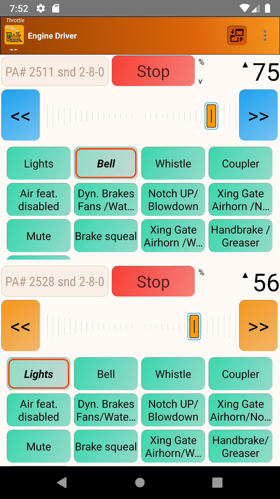

*******************************************
About
*******************************************
.. meta::
   :description: JMRI Engine Driver Throttle
   :keywords: Engine Driver EngineDriver JMRI manual help

Engine Driver Throttle (normally just referred to as Engine Driver or 'ED') is a free Android application that connects to a `WiThrottle Server <https://jmri.org/help/en/package/jmri/jmrit/withrottle/UserInterface.shtml>`_ to control model trains. 

Supported servers include `JMRI <https://jmri.org/>`_, `DCC-EX <https://dcc-ex.com/>`_, `MRC Prodigy WiFi <https://www.modelrectifier.com/category-s/332.htm>`_, `Digitrax LnWi <https://www.digitrax.com/products/wireless/lnwi/>`_, and `WifiTrax (for NCE) <http://wifitrax.com/products/product-WFD-30-detail.html>`_. 
Once connected, you can control your locomotives and your entire model railroad. Speed, direction, and up to 29 DCC functions are supported for one to six locomotives or consists. You can create and edit consists (software-defined). You can also control layout power, turnouts/points, routes, and access JMRI web panels and windows.

Generally the wiThrottle servers that Engine Driver connect to are either DCC Command stations, or are design to talk to DCC Command Stations to subsequently talk to DCC Decoder equiped locootives on a layout.  However DCC++EX is currently experimenting with the possibility of controling DC locomotives or even Slot cars instead.

Engine Driver is open source software. The source code is available on `github.com/JMRI/EngineDriver <https://github.com/JMRI/EngineDriver>`_.
This documentation is also open source and can be accessed on `github.com/flash62au/EngineDriver_Home <https://github.com/flash62au/EngineDriver_Home>`_

Contribution to both the code and documentation is welcome.  See [`here <../contributing/index.html>`_] for details.

Engine Driver currently has minSDKVersion set to 16, which equates to Android OS 4.1 (JELLYBEAN). 
Info on minSDKVersion available `[here] <https://developer.android.com/guide/topics/manifest/uses-sdk-element#ApiLevels>`_.
