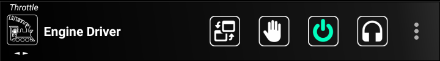

*******************************************
Preferences
*******************************************

.. meta::
   :keywords: options preferences

.. include:: ../include.rst

.. sidebar::

  .. contents:: On This Page
    :local:
    :depth: 3

----

|ed| is highly configurable.  There are over 100 different items than can be changed to allow you customise your experience with |ED|\ .

Most configuration options are found in the *Preferences* which is accessed via the overflow menu, sometimes called a 'hamburger menu', which is normally three dots (⁞) or three bars (≡).

Advanced Preferences
--------------------------

Show Advanced Preferences?
""""""""""""""""""""""""""

By default, only a small number of core preferences are displayed on the *Preferences Screen*. 

If you enable this preference |ed| will immediately show all the additional preferences.

Device Preferences
------------------

The following preferences provide options for the 'whole' of |ed|.

Throttle Name
"""""""""""""

Use this to enter a unique name for your device/phone.  The name will appear in the WiThrottle window in JMRI.  While not significant ion a single user layout, having a name on the device can be useful in club or multi user environments, especially when trying to sort out issues.
  
Screen orientation
""""""""""""""""""

There are four options to choose from:

* Portrait
* Landscape
* Auto-Rotate
* Auto-Web

.. list-table::
    :width: 100%
    :widths: 60 40
    :header-rows: 1

    * - Example
      - Theme
    * - .. image:: ../_static/images/screenshots/throttle_horizontal_outline_theme.png  
          :scale: 8%
      - Portrait
    * - .. image:: ../_static/images/screenshots/throttle_horizontal_landscape_outline_theme.png 
          :scale: 8%
      - Landscape
    * - see above 
      - Auto-Rotate |br|\ will switch between |br|\ Portrait and |br|\ landscape when |br|\ you rotate the |br|\ screen
    * - .. image:: ../_static/images/screenshots/auto_web.png
          :scale: 8%
      - Auto-Web |br|\ will show the |br|\ |WV-S| when |br|\ you rotate the |br|\ screen

Theme/Style
"""""""""""

Themes provide different colours and textures to the buttons, backgrounds, sliders etc.  You can switch between different themes by changing this preference. 

There are five themes to choose from:

* Original 
* High contrast
* High contrast *outline*
* Dark
* Colourful

.. list-table::
    :width: 100%
    :widths: 50 50
    :header-rows: 1

    * - Example
      - Theme
    * - .. image:: ../_static/images/screenshots/throttle_horizontal_original_theme.png  
          :scale: 8%
      - Original theme
    * - .. image:: ../_static/images/screenshots/throttle_horizontal_high_contrast_theme.png 
          :scale: 8%
      - High contrast theme |br|\ |br|\ Similar to the original |br|\ theme, without the |br|\ textured background |br|\ with deeper blacks |br|\ and brighter whites.
    * - .. image:: ../_static/images/screenshots/throttle_horizontal_outline_theme.png
          :scale: 8%
      - High contrast |br|\ Outline theme |br|\ |br|\ For people who like |br|\ white text on a |br|\ black background.
    * - .. image:: ../_static/images/screenshots/throttle_horizontal_dark_theme.png
          :scale: 8%
      - Dark theme
    * - .. image:: ../_static/images/screenshots/throttle_horizontal_colorful_theme.png
          :scale: 8%
      - Colourful theme

Localisation
""""""""""""

Changing the *Localisation* primarily changes the language used in the menus, buttons and messages throughout |ED|.

For English, it also changes the railroad/railway terminology (eg, Selecting 'Use Phone's global setting' and having this set to 'English (Australia)' or 'English (UK)' results in the term 'Points' to be displayed rather than 'Turnouts' which is displayed when 'English (US)' is selected). In the Preferences screen and the Throttle Screen Layout selection preference (where 'shunting' is displayed rather than 'switching').  This is not guaranteed to operate on all text on all screens. 

Supported localisations are:

* Use Phone's global setting |br| -  Will use any of the localisations below depending on what your system is set to it
* English (US) |br| - Engine Driver's default
* Italian
* Portuguese
* German
* Spanish
* Catalan
* French
* Czech

The following can't be chosen in the preference, but will be activated automatically if you select ``Use the Phone's global setting`` and you have selected one of the following primary languages in you Device's / Phone's global settings:

* English (UK)
* English (AUS)
* English (NZ)

Left/Right Swipe Preferences
""""""""""""""""""""""""""""

The following preferences provide options for how *left/right swipes* work and which screens are available when you swipe left / right.

Disable full screen Swipe?
'''''''''''''''''''''''''''''''''''

If this preference is enabled, only the Action Bar can be swiped to change screens.  This is useful if you find it difficult to swipe left and right on either of the two Web Views without accidently changing screens.

Swipe through Web?
'''''''''''''''''''''''''''''''''''

If this preference is enabled, the |WV-S| is included in the list of screens when swiping left/right between screens.

Swipe Through Turnouts/Points?
'''''''''''''''''''''''''''''''''''

If this preference is enabled, the |TP-S| is included in the list of screens when swiping left/right between screens.

Swipe through Routes?
'''''''''''''''''''''''''''''''''''

If this preference is enabled, the |R-S| is included in the list of screens when swiping left/right between screens.

Throttle Screen Appearance Preferences
--------------------------------------

The following preferences provide options for the appearance of the |T-S|.

Throttle Screen Layout
""""""""""""""""""""""

.. list-table::
    :widths: auto
    :header-rows: 1

    * - Layout Name
      - No. |br|\ Throttles
      - Slider |br|\ Orient.
      - Web |br|\ View
      - Function |br|\ Buttons
      - Throttle |br|\ Control
      - Direction |br|\ Buttons
    * -  Horizontal
      - 1 \- 3 
      - H
      - ✓
      - ✓
      - 0-100
      - ✓
    * - Vertical
      - 2
      - V
      - ✓    
      - ✓
      - 0-100    
      - ✓
    * - Big Buttons - Left
      - 1
      - 🗴
      - 🗴
      - ✓
      - 0-100
      - ✓
    * - Big Buttons - Right
      - 1
      - 🗴
      - 🗴
      - ✓
      - 0-100
      - ✓
    * - Vertical - Left
      - 1
      - V
      - ✓
      - ✓
      - 0-100
      - ✓
    * - Vertical - Right
      - 1
      - V
      - ✓
      - ✓
      - 0-100
      - ✓
    * - Vertical Shunting |br| Vertical Switching
      - 2
      - V
      - ✓
      - ✓
      - \-100 - 0 - +100
      - 🗴
    * - Vertical Shunting - Left |br| Vertical Switching - Left
      - 1
      - V
      - ✓
      - ✓
      - \-100 - 0 - +100
      - 🗴
    * - Vertical Shunting - Right |br| Vertical Switching - Right
      - 1
      - V
      - ✓
      - ✓
      - \-100 - 0 - +100
      - 🗴
    * - Horizontal Shunting |br| Horizontal Switching
      - 1 \- 3
      - H
      - ✓
      - ✓
      - \-100 - 0 - +100
      - 🗴
    * - Simple |br| (Tablet Recommended)
      - 1 \- 6
      - V
      - 🗴
      - see note
      - 0-100
      - ✓
    * - Tablet Shunting Left
      - 1 \- 6
      - V
      - ✓
      - ✓
      - \-100 - 0 - +100
      - 🗴
    * - Tablet Vertical Left
      - 1 \- 6
      - V
      - ✓
      - ✓
      - 0-100
      - ✓
    * - Semi-Realistic Left
      - 1
      - V
      - ✓
      - 🗴
      - 0-100
      - ✓

.. list-table::
    :width: 100%
    :widths: 50 50
    :header-rows: 1

    * - Example
      - Name
    * - .. image:: ../_static/images/screenshots/throttle_horizontal_high_contrast.png 
          :scale: 8%
      - Horizontal
    * - .. image:: ../_static/images/screenshots/throttle_vertical_high_contrast.png 
          :scale: 8%
      - Vertical
    * - .. image:: ../_static/images/screenshots/throttle_big_buttons_left_high_contrast.png 
          :scale: 8%
      - Big Buttons - Left
    * - .. image:: ../_static/images/screenshots/throttle_big_buttons_right_high_contrast.png 
          :scale: 8%
      - Big Buttons - Right
    * - .. image:: ../_static/images/screenshots/throttle_vertical_left_high_contrast.png 
          :scale: 8%
      - Vertical - Left
    * - .. image:: ../_static/images/screenshots/throttle_vertical_right_high_contrast.png 
          :scale: 8%
      - Vertical - Right
    * - .. image:: ../_static/images/screenshots/throttle_vertical_switching_high_contrast.png 
          :scale: 8%
      - Vertical Switching |br| Vertical Shunting 
    * - .. image:: ../_static/images/screenshots/throttle_vertical_switching_left_high_contrast.png 
          :scale: 8%
      - Vertical Switching |br| - Left |br| Vertical Shunting |br| - Left
    * - .. image:: ../_static/images/screenshots/throttle_vertical_switching_right_high_contrast.png 
          :scale: 8%
      - Vertical Switching |br| - Right |br| Vertical Shunting |br| - Left
    * - .. image:: ../_static/images/screenshots/throttle_horizontal_switching_high_contrast.png 
          :scale: 8%
      - Horizontal Switching |br| Horizontal Shunting
    * - .. image:: ../_static/images/screenshots/throttle_simple_high_contrast.png 
          :scale: 8%
      - Simple

Notes:

* The number is brackets after the Throttle Screen Layout name is the number of throttles that the layout can support.
* The 'Simple' Throttle Screen Layout is designed to allow for up to 6 throttles simultaneously.  |br|\ It is recommended that this be used on a tablet device, because of the screen real estate demands that 6 throttles requires. |br|\ When this Throttle Screen Layout is selected, the `Number of Throttles`_ preferences options is activated.  You can then use this to restrict the number of throttles being displayed on the 'Simple' Throttle Screen Layout.  |br|\ Also the `Function Buttons Area size`_ preferences options is activated.  You can then use this to control how many Function Buttons are displayed with each throttle.  By default, no Function buttons will be shown. |br|\ If you have selected In Phone Loco Sounds, then you may want to set this to three or four (for Mute, Bell and Whistle/Horn, Short Horn/whistle).

|ed| will automatically reload the |T-S| after closing the preferences screen. 

Number of throttles 
"""""""""""""""""""

This preference allows you to set how many throttles to display on the |T-S|. (Limited by the selected Throttle Screen Layout.)

Only available for the following Throttle Screen Layouts:

* Horizontal (1-3)
* Horizontal Shunting / Horizontal Switching (1-3)
* Simple (1-6)

All other layouts will automatically change this preference to the fixed number for that particular layout.

Speed Slider and Buttons Preferences
""""""""""""""""""""""""""""""""""""

The following preference allows you to adjust aspects of the Throttle Areas on the |T-S|.

Increase Slider/Speed Height?
'''''''''''''''''''''''''''''''''''

When set, this preference will show a taller Slider, or Speed buttons, for throttles.

Only relevant for the following Throttle Screen Layouts:

* Horizontal (1-3)
* Horizontal Shunting / Horizontal Switching (1-3)

Throttle Speed Slider Margin
'''''''''''''''''''''''''''''''''''

When set, this changes the space between either the edge of the screen and the ends of the Slider, or if the Speed Buttons are enabled, the edge of the Speed Buttons and the ends of the Slider.  Specific in pixels haw far to offset.  This is useful if you find it difficult to get the zero or maximum speeds without accidently touching the Speed Buttons.

Only relevant for the following Throttle Screen Layouts:

* Horizontal (1-3)
* Horizontal Shunting / Horizontal Switching (1-3)

Display Speed buttons?
'''''''''''''''''''''''''''''''''''

When this preferences is set, |ED| will display buttons (``++`` and ``--``) next to Speed Sliders to change loco speed.  

Clicking the ``++`` button will increase the speed of the Locos(s) by a preset amount. Clicking the ``--`` button will increase the speed of the Locos(s) by a preset amount.  

The amount the speed changes on each press can be changed with the `Speed Button Change Amount`_ preference.  Note that this is independent of the `Speed Button Change Amount (Volume)`_ preference and the `Speed Button Change Amount (Gamepad)`_ preference.

Holding down a button will increase / decrease the speed continuously by the preset amount, in series of steps.

The time between steps can be changed with the `Speed Button Repeat Delay`_ preference.  Note that this is independent of the `Speed Button Repeat Delay (Gamepad)`_ preference.  But the Volume button repeat Delay is linked to it.

Hide Speed Slider?
'''''''''''''''''''''''''''''''''''

When this preferences is set, |ED| will not show speed slider, use speed buttons instead.

This option is not relevant for the following Throttle Screen Layouts as they cannot have a slider:

* Big Buttons - Left
* Big Buttons - Right

Hide Slider AND Speed Buttons?
'''''''''''''''''''''''''''''''''''

When this preferences is set, |ED| will show neither speed slider nor speed buttons.t

Only really of use on the ESU MCII

This option is not relevant for the following Throttle Screen Layouts as they cannot be without the Speed buttons:

* Big Buttons - Left
* Big Buttons - Right

Tick Marks on Speed Sliders?
'''''''''''''''''''''''''''''''''''

When this preferences is set, |ED| will show tick marks on the background of the Speed Sliders.

Switching throttle Dead Zone
'''''''''''''''''''''''''''''''''''

When this preferences is set, |ED| will set the size of the dead zone, or detent, on the slider of the Switching/Shunting Throttle Screen.  The larger the size, the easier it is to find Zero on the slider.

Only relevant to the following Throttle Screen layouts:

* Vertical Shunting |br| Vertical Switching
* Vertical Shunting - Left |br| Vertical Switching - Left
* Vertical Shunting - Right |br| Vertical Switching - Right
* Horizontal Shunting |br| Horizontal Switching
* Horizontal Shunting - Left |br| Horizontal Switching - Left
* Horizontal Shunting - Right |br| Horizontal Switching - Right

Stop Button Vertical Margins
'''''''''''''''''''''''''''''''''''
   
When this preferences is set, |ED| will add the entered number of pixels to offset margins of the stop button from the speed buttons and bottom of screen.  This is useful if you find it difficult to get the zero speeds on the vertical sliders without accidently touching the Stop Button.

Only relevant to the following Throttle Screen layouts:

* Vertical
* Vertical Shunting |br| Vertical Switching
* Vertical Shunting - Left |br| Vertical Switching - Left
* Vertical Shunting - Right |br| Vertical Switching - Right

Haptic Feedback (Vibration) Preferences
"""""""""""""""""""""""""""""""""""""""

The following preferences provide options for how and when the Device / Phone will *vibrate* on certain actions.

Haptic Feedback (Vibration)
'''''''''''''''''''''''''''''''''''

When this preferences is set, |ED| will the device / phone will provide Haptic feedback (vibrate) on speed changes.

Options:

* None
* Slider - Every Step
* Slider - Skip some at 29, 100, 128 Steps

Haptic Feedback Duration
'''''''''''''''''''''''''''''''''''

Use with preference to change the duration of each vibration (in milliseconds).

Haptic Feedback on Button Presses
'''''''''''''''''''''''''''''''''''
 
When this preferences is set, |ED| will provide haptic feedback (vibrate) on button presses.

Direction Button Preferences
""""""""""""""""""""""""""""

The following preferences provide options for Direction Buttons.

Swap Direction buttons?
'''''''''''''''''''''''''''''''''''

When this preferences is set, |ED| will permanently swap the two Direction buttons for all throttles.

Long press Swap Direction buttons?
'''''''''''''''''''''''''''''''''''

When this preferences is set, |ED| will temporarily swap the two Direction buttons when you long press of either of the Direction buttons.

Direction button Long Press Delay
'''''''''''''''''''''''''''''''''''

This preference allows you to set how many milliseconds constitutes a long press for the direction buttons.

Left Direction button Label
'''''''''''''''''''''''''''''''''''

You can use this preference to change the labels for all LEFT direction buttons. 

Enter \'Forward\' or blank for normal behaviour.

Right Direction button Label
'''''''''''''''''''''''''''''''''''

You can use this preference to change the labels for all RIGHT direction buttons.

Enter \'Reverse\' or blank for normal behaviour.

Short Left Direction button Label
'''''''''''''''''''''''''''''''''''

You can use this preference to change the short labels for all LEFT direction buttons.

Enter 'Fwd' or blank for normal behaviour.

Short Right Direction button Label
'''''''''''''''''''''''''''''''''''
 
You can use this preference to change the short labels for all RIGHT direction buttons.

Enter 'Rev' or blank for normal behaviour.

Decrease Loco No. height?
"""""""""""""""""""""""""

You can use this preference to have |ed| use smaller buttons for the Loco Number, Speed and Direction buttons

Loco Address instead of Name?
"""""""""""""""""""""""""""""

You can use this preference to have |ed| to show loco DCC Address(es) instead of the Roster Name(s) on the |T-S|.  It will ignore the Roster name for the :guilabel:`Select` button label.  This changes the label only.  It has no other functional effect.

Default Function Preferences
""""""""""""""""""""""""""""

The following preferences provide options for when and how the default Function Labels are displayed.

Use default function labels?
'''''''''''''''''''''''''''''''''''

You can use this preference to have |ed| *always* display the default Function Labels (configured inside |ed|\ ) instead of labels from roster entries. It will ignore the Roster for the Function button labels.  It changes the labels only.  It has no other functional effect.

Number of Default Functions
'''''''''''''''''''''''''''''''''''

You can use this preference to limit the Function to limit the Function Labels shown for selected locos that are not from the Server Roster, or where you have set the `Use default function labels?`_ preference. 

Number of Default Functions for Roster
''''''''''''''''''''''''''''''''''''''

You can use this preference to limit the Function Labels shown for Server Roster Entries that don't have any function Labels configured.

Function Buttons Area size
""""""""""""""""""""""""""

You can use this preference to instruct |ed| to show some, or no, Function Buttons (0-4) below the Speed Slider the 'Simple' Throttle layout ONLY.

Only relevant to the following Throttle Screen layouts:

* Simple

Throttle Web View Preferences
"""""""""""""""""""""""""""""

The following preferences provide options for options for *Throttle Web View* appearance.

The *Throttle Web View* is a smaller (approximately half page) Web browser window that will appear at the bottom of the Throttle Screen, and is difference to the main Web View Screen.  The two are configured independently.

Throttle Web View?
'''''''''''''''''''''''''''''''''''

You can use this preference to have |ed| to show a *Web View* area on the |T-S| which is essentially a Web Browser.

Larger Throttle Web View?
'''''''''''''''''''''''''''''''''''

You can use this preference to instruct |ed| to increase the Throttle Web View size to 60% for small screens

Initial throttle Web Page
'''''''''''''''''''''''''''''''''''

You can use this preference to set the initial throttle Web Page (such as '/panel/') for when the *Throttle Web View* first opens.

Enter the initial Web Page (such as '/panel') for the |WV-S|

Note that this is different to the 'Web View Screen' initial Web Page which is set with the `Initial Web Screen Page`_ preference.

Swipe Up-Down Preferences
"""""""""""""""""""""""""

The following preferences provide options for options for swipe up or down on the |T-S|

Use Immersive Mode for Throttle view?
'''''''''''''''''''''''''''''''''''''

Setting this preference will display the Throttle view full screen.  The Navigation bar and the Status Bar will be hidden, Swiping down from off the screen will temporarily show them again.

Hide Toolbar in Immersive Mode?
'''''''''''''''''''''''''''''''''''

Setting this preference, along with `Use Immersive Mode for Throttle view?`_ preference will display the Throttle view in and extended full screen.  The Action Bar, along with the Navigation bar and the Status Bar will be hidden, Swiping down from off the screen will temporarily show the the Navigation bar and Status bar again, but not the Action Bar.

It is essential, that you can set `Swipe down action in the Throttle view?`_ or `Swipe up action in the Throttle screen?`_ preferences to temporarily disable this and allow you to reach the menu.

Swipe down action in the Throttle view?
'''''''''''''''''''''''''''''''''''''''

This preference allows you to select what should happen when you *swipe down* on the |T-S|.

Options:

* None
* Hide Web View |br| (requires `Throttle Web View?`_ preference to be set)
* Lock and Dim Screen
* Dim Screen
* Immersive Mode temporarily enable-disable
* Switch Throttle Screen Layouts

Swipe up action in the Throttle screen?
'''''''''''''''''''''''''''''''''''''''

This preference allows you to select what should happen when you *swipe up* on the |T-S|.

Options:

* None
* Hide Web View |br| (requires `Throttle Web View?`_ preference to be set)
* Lock and Dim Screen
* Dim Screen
* Immersive Mode temporarily enable-disable
* Switch Throttle Screen Layouts

Screen Dimming % Value
'''''''''''''''''''''''''''''''''''

This preference allows you to enter the brightness setting/level to use when dimming the screen (0%-99%). Disables Auto or Adaptive Brightness if set.

Requires that one of the following preferences is set to ``Lock and Dim Screen`` or ``Dim Screen`` to have any effect:

* `Swipe down action in the Throttle view?`_
* `Swipe up action in the Throttle screen?`_
* `Accelerometer (Shake) Preferences`_

Accelerometer (Shake) Preferences
"""""""""""""""""""""""""""""""""

The following preferences provide options for options for what happens when you shake your device / phone while on the |T-S|.

Shake Action
'''''''''''''''''''''''''''''''''''

This preference allows you to select what happens when you shake your device phone.

Options:

* None
* Hide Web View |br| (requires `Throttle Web View?`_ preference to be set)
* Lock and Dim Screen
* Dim Screen
* Immersive Mode temporarily enable-disable
* Switch Throttle Screen Layouts

Shake Threshold
'''''''''''''''''''''''''''''''''''

This preference allows you to enter the threshold level at which the shake will register. (1.5 - 3.5) Lower value will respond to a gentle action.
Requires restart of engine Driver after changing to take effect.

Background Image Preferences
""""""""""""""""""""""""""""

.. image:: ../_static/images/screenshots/background_fill.png
  :align: right
  :scale: 12%

The following preferences provide options for showing a background image on the |T-S|.

Background Image
'''''''''''''''''''''''''''''''''''

Enabling this preference will cause |ed| to show a background image on the |T-S|, as long as one is selected in the `Background Image File Name`_ preference.

Background Image File Name
'''''''''''''''''''''''''''''''''''

This preference allows you to select a image file that will be used as the background o the |T-S|.  This has no effect unless the `Background Image`_ preference is enabled.

Clicking on this preference launches your image chooser app.  As this can be different on different devices / manufacturers, it is impossible to describe the required steps here.  In general, use the app's navigation features to find the image you want and select it.

Note: You can install additional apps to do the same job for the Play Store.

Background Image Position
'''''''''''''''''''''''''''''''''''

This preference lets you select how the background image will be positioned and/or resized on the screen.

Options include:

* Fit - Shrink/expand
* Fill - Crop one edge pair
* Center - No scaling
* Fit - Shrink only
* Fill - Distort if needed

  **Fit - Shrink/expand**

  Using this option will cause the image to be:
  
  * proportionally reduced in size in too big to fit the screen, such that the image fills the screen in at least one dimension
  * proportionally increased in size in too small to fill the screen, such that the image fills the screen in at least one dimension

  **Fill - Crop one edge pair**

  Using this option will cause the image to be:
  
  * proportionally reduced in size in too big to fit the screen, such that the image will be cropped on either the top/bottom or the sides, so that the image fills the screen 
  * proportionally increased in size in too small to fill the screen, such that the image will be cropped on either the top/bottom or the sides, so that the image fills the screen

  **Center - No scaling**

  Using this option will cause the image to be centered on the screen.  It will not be either shrunk or expanded.

  **Fit - Shrink only**

  Using this option will cause the image to be proportionally reduced in size in too big to fit the screen, such that the image fills the screen in at least one dimension.  If it to smaller than the screen in both dimensions it will not be resized.

  **Fill - Distort if needed**

  Using this option will cause the image to be forcibly:

  * reduced in size in too big to fit the screen, distorting the image if needed to fill the entire screen in both dimensions
  * increased in size in too small to fill the screen, distorting the image if needed to fill the entire screen in both dimensions

Throttle Screen Action Bar Preferences
--------------------------------------

The following preferences provide options for showing additional buttons on the Action Bar, primarily at the top of the |T-S| though some will show on many screens.

Emergency Stop button?
""""""""""""""""""""""

.. image:: ../_static/images/parts/estop.png
   :align: right
   :scale: 50%

Setting this preference will display an Emergency Stop button in Action Bar of most of the Main Screens.

Clicking this button will attempt to quickly stop all locos controlled by the device / phone.  Locos controlled by other people/devices are not stopped.

Layout Power button?
""""""""""""""""""""

.. image:: ../_static/images/parts/power_green.png
   :align: right
   :scale: 50%

Setting this preference will display a *Layout Power button* in Action Bar of most of the Main Screens.

Clicking this button will turn on/off the power to the track. The colour of the button will change colour:

* 'Amber' = unknown state
* 'Red' = Power is Off
* 'Green' = Power is On

Flashlight button?
""""""""""""""""""

.. image:: ../_static/images/parts/flashlight_on.png
   :align: right
   :scale: 50%

Setting this preference will display a *Flashlight* button in action bar of the |T-S|.

Clicking this button will turn on/off the Device's camera light.

This preference will be disabled (unable to be set) if the device does not have a camera.

Fast Clock Display
""""""""""""""""""

.. image:: ../_static/images/parts/fast_clock.png
   :align: right
   :scale: 50%

Use this preference to set the format for *Fast Clock display* in action bar:

* none
* 12 Hour format
* 24 Hour format

Throttle Web View button?
"""""""""""""""""""""""""

.. image:: ../_static/images/parts/web_view.png
   :align: right
   :scale: 50%

Setting this preference will display a button in action bar of the |T-S| to show/hide *Throttle Web View*. Requires `Throttle Web View?`_ preference to be enabled.

Clicking this button will show / hide the *Throttle Web View* on the |T-S|.

Note: If the `Throttle Web View?`_ preference is not enabled the button will do nothing.

Layout Switch Button Preferences
""""""""""""""""""""""""""""""""

The following preferences provide options for an optional button on the Action Bar to switch Throttle Screen layouts.

Show Layout Switch button?
'''''''''''''''''''''''''''''''''''

.. image:: ../_static/images/parts/throttle_switch_button.png
   :align: right
   :scale: 50%

Enabling this preference shows the Throttle Layout Switch button in the |T-S| Action Bar to allow quick changing between to preset Throttle Layouts.

Clicking on this button will immediately change the layout of the |T-S| between the layouts select in the `First Screen Layout`_ and `Second Screen Layout`_ preferences.

First Screen Layout
'''''''''''''''''''''''''''''''''''

This preference allows you to select one of the two Layouts that the Layout Switch Button will switch between.  (This throttle layout and the next preference.)

See the `Throttle Screen Layout`_ preference for the available options.

Second Screen Layout
'''''''''''''''''''''''''''''''''''

This preference allows you to select one of the two Layouts that the Layout Switch Button will switch between.  (This throttle layout and the previous preference.)

See the `Throttle Screen Layout`_ preference for the available options.

In phone sounds button
""""""""""""""""""""""

.. image:: ../_static/images/parts/in_device_sounds_outline.png
   :align: right
   :scale: 50%

Enabling this preference shows an action bar button on the |T-S| to easily change the in *phone loco sounds* options.  

Clicking the button shows the `In Phone Loco Sounds Screen <../operation/interface.html#in-phone-loco-sounds-screen>`_. 

Show Server Description
"""""""""""""""""""""""

Setting this preference will display the description of the current server on the Action Bar.

DCC-EX button?
""""""""""""""

Enabling this preference will cause |ED| to show an additional button on the Action Bar that allows to to quickly to the DCC-EX screen.

Refer to :doc:`this page <../operation/dcc-ex-native-protocol>` additional information.

Throttle Control Preferences
----------------------------

The following preferences provide options for how the throttle on the |T-S| will behave.

Speed Units
"""""""""""

Use this preference to change how the speed is displayed and functions on all the throttles on the |T-S|.

Options:

 * Percent 0 - 100%
 * Auto Speed steps
 * 8 steps
 * 10 steps
 * 14 steps
 * 28 steps
 * 128 steps

Note that the `Speed button Change Amount`_ preference will work in the units that you choose here.

Maximum throttle Percentage
"""""""""""""""""""""""""""

This preference allows you to set the maximum allowed throttle slider value in % on all the throttles on the |T-S|.

Maximum throttle Change
"""""""""""""""""""""""

This preference allows you to set the Maximum allowed throttle change in % on all the throttles on the |T-S|.  

.. todo::  Maximum throttle Change *Can't remember when this is used.*

Speed button Change Amount
""""""""""""""""""""""""""

This preference allows you to set how much the Speed buttons jump/change the speed.

Note that this works in the units chosen in the `Speed Units` preference.i.e. If your Speed Units are '8 Steps' and your Speed button change amount is '4' then just two click will get you from zero to 100% speed.

Speed button Repeat Delay
"""""""""""""""""""""""""

Use this preference to change how long between repeats on speed buttons. Smaller is faster. Excludes gamepad buttons. 

Note that this is independent of the equivalent gamepad preference. (`Speed button Repeat Delay (gamepad)`_)

Speed step on Decrement?
""""""""""""""""""""""""

Use this preference to force the `Speed button Change Amount`_ to be used when long pressing a lower speed on the slider. If not enabled, the speed will immediately jump to the touched speed.

Stop on Phone call?
"""""""""""""""""""

If the preference is enabled, |ed| will stop all loco(s) controlled by the device /phone when a phone call is answered or placed.

Direction change while moving?
""""""""""""""""""""""""""""""

If the preference is enabled, |ed| will allow you to change the direction of the locos controlled by a throttle to instantly change direction.  i.e. Both directions buttons are allows available.

Stop on direction change?
"""""""""""""""""""""""""

If the preference is enabled, |ed| will stop the locos controlled by a throttle if you click the opposite direction while the loco(s) are moving.  Effectively this means that the 'opposite' direction will (also) act like a stop button.

'Limit Speed' & 'Pause' button Preferences
""""""""""""""""""""""""""""""""""""""""""

These preferences allow for additional buttons to appear in the Function Button area of each Throttle on the |T-S|, but are not related to DCC Functions.

Show 'Limit Speed' button?
'''''''''''''''''''''''''''''''''''

If this preference is enabled, |ed| will show a :guilabel:`Limit Speed` button in all the throttles in the |T-S|. 

When clicked, |ED| will temporarily restrict the maximum speed on the individual throttle.  The speed tat it limits to is set with the `'Limit Speed' button`_ preference.

'Limit Speed' button
'''''''''''''''''''''''''''''''''''

Use this preference to set the amount, as a percentage (\%), of the throttle that the speed will be temporarily limited to when you click the :guilabel:`Limit Speed` button. 

Note: If the `Show 'Limit Speed' button?`_ preference is not enabled this has no effect.

Show 'Pause' button?
'''''''''''''''''''''''''''''''''''

If this preference is enabled, |ed| will show a :guilabel:`Pause` button in all the throttles in the Throttle Screen. 

When clicked, |ED| will gradually slow and stop the loco(s) of a throttle. When pressed again |ED| will return the loco(s) to original speed.

'Pause' button Rate
'''''''''''''''''''''''''''''''''''

Use this preference to set the number of milliseconds between speed step changes for the Pause action.

Only relevant is the `Show 'Pause' button?`_ preference is enabled.

'Pause' button Step
'''''''''''''''''''''''''''''''''''

Use this preference to set amount, as a percentage (\%), of the throttle that the speed will change by (step) each time after the ``Pause`` is clicked.

Only relevant is the `Show 'Pause' button?`_ preference is enabled.

Consist Function Follow Preferences
-----------------------------------

These preferences allow for change the way DCC functions will behave in a consist/multiple unit train.

Consist Functions - Follow Rule Style
"""""""""""""""""""""""""""""""""""""

.. todo::  Consist Functions - Follow Rule Style

See the `Advanced Consist Function Mapping <./configuration/functions.html#advanced-consist-function-mapping>` section of the Functions page for more information.

Which style of rules to follow in a consist when function buttons are pressed.

Note: If 'Use Default function labels' is enabled, 'Special...' will also apply to the lead (or only) loco.

Options

* Simple text matching (original)
* Complex text matching - Lead loco always activated, Trail follows rules below
* Special Exact - Lead and All Trail activated if they exactly match the function labels
* Special Partial - Lead and All Trail activated if they partially match the function labels

Selective Lead Unit Sound?
""""""""""""""""""""""""""

.. todo:: Selective Lead Unit Sound?

Send Horn/Bell functions to only the Lead unit in an EngineDriver consist. 

(Only/any function with a 'label' that includes 'bell', 'horn' or 'whistle' as part of the label.)

Always treat F1 as Sound?
"""""""""""""""""""""""""

.. todo:: Always treat F1 as Sound?

For the 'Selective Lead Unit Sound' option

Always treat F2 as Sound?
"""""""""""""""""""""""""

.. todo:: Always treat F2 as Sound?

For the 'Selective Lead Unit Sound' option

If All matches Fail Action
""""""""""""""""""""""""""

.. todo:: If All matches Fail Action

Which locos in the consist should react to the function buttons if none of the rules below are meet.

For the 'Simple' and 'Complex' options only.

Headlight specific String 1
"""""""""""""""""""""""""""

.. todo:: Headlight specific String 1

Comma separated string(s) to look for in the function labels of the locos in the consist to recognise the \'Headlight\' function (normally F0).

For the 'Simple' and 'Complex' options only.

Headlight specific Action 1
"""""""""""""""""""""""""""

.. todo:: Headlight specific Action 1

Which locos in the consist should react to the found headlight functions.

For the 'Simple' and 'Complex' options only.

String 2, 3, 4, 5
"""""""""""""""""

.. todo:: String 2, 3, 4, 5

For the 'Simple' and 'Complex' options only.

Action for String 2, 3, 4, 5
""""""""""""""""""""""""""""

.. todo:: Action for String 2, 3, 4, 5

For the 'Simple' and 'Complex' options only.

Additional Throttle Control Source Preferences
----------------------------------------------

|ed| allows for methods, other than the touch screen, to control locos.  The following preferences allow you change options relating to these.

Volume Button Preferences
"""""""""""""""""""""""""

|ed| will allows you to use the device/phone's hardware :guilabel:`Volume Up` and :guilabel:`Volume Down` buttons to control speed. The following preferences allow you change options relating to these.

Speed button Change Amount (Volume)
'''''''''''''''''''''''''''''''''''

Use this preference to set amount, as a percentage (\%), of the throttle that the speed will change by (step) each time the device/phone's hardware :guilabel:`Volume Up` and :guilabel:`Volume Down` buttons are clicked.

Only relevant is the `Disable Volume keys?`_ preference is DISABLED.

Disable Volume keys?
'''''''''''''''''''''''''''''''''''

Enable this preference if you need to DISABLE the hardware Volume keys on the phone/tablet that would otherwise control speed

If this preference is DISABLED, |ed| will allows you to use the device/phone's hardware :guilabel:`Volume Up` and :guilabel:`Volume Down` buttons to control speed of the selected loco (indicated by a 'v' in the Speed Amount area of the Throttle.

Volume keys follow touch?
'''''''''''''''''''''''''''''''''''

Enable this preference if you want the Volume keys speed control to follow the last touched throttle.  Otherwise you need to touch the speed amount area of a Throttle to change the Volume keys to control that throttle.

----

Gamepad Preferences
"""""""""""""""""""

|ed| will allows you to use the inexpensive gamepads to control speed. The following preferences allow you change options relating to these (if connected).

.. note:: 
  :class: note-ed-hidden-title

   See the `Gamepad Operation page <../operation/gamepads.html>`_ page for more information on using gamepads.

Gamepad type
''''''''''''

|ed| supports the following gamepad types and modes:

* None  =   *disable gamepad support*
* Mocute iCade
* Mocute iCade+DPAD
* Mocute MTK
* Mocute Android-Game
* VRBOX/Android- A Mode
* VRBOX/Android- A Mode - DPAD rotated
* VRBOX/Android- C Mode
* VRBOX/Android- C Mode - DPAD rotated
* VRBOX/iOS- C Mode
* VRBOX/iOS- C Mode - DPAD rotated
* MagicseeR1 Android-Game B
* Flydigi Wee 2
* Utopia 360 Android-C
* ESP32 DIY (4x4 Keypad +Encoder)
* ESP32 DIY (3x4 Keypad +Encoder)
* Keyboard

Choose the option that best supports your gamepad, 'None' to disable gamepad support.

.. note:: 
  :class: note-ed-hidden-title

   See the `Gamepads page <../operation/gamepads.html#example-gamepads>`_ page for more information on selecting a gamepad.

Only One Gamepad?
'''''''''''''''''

.. todo:: Only One Gamepad?

If enabled Engine Driver will not check for multiple gamepads.

Test Gamepad settings now!
''''''''''''''''''''''''''

This preference allows you to confirm that the chosen setting are working correctly.  The Gamepad Test screen will launch IMMEDIATELY on selection.

Note: that you may need to repeat the test process when you return to the |T-S| and use the gamepad for the first time.

Speed button Change Amount (Gamepad)
''''''''''''''''''''''''''''''''''''

How much each press of the Gamepad buttons changes the throttle speed

Use this preference to set the amount, as a percentage (\%), of the throttle that the speed will change by (step) each time a gamepad's buttons are pressed.

Only relevant is the `Gamepad Type`_ preference is set to other than 'None' and you have configured any of the gamepad's buttons to speed up or down.

Gamepad Button Click Volume %
'''''''''''''''''''''''''''''

Use this preference to set the volume, as a percent, for gamepad button clicks.

Speed button Repeat Delay (gamepad)
'''''''''''''''''''''''''''''''''''

Use this preference to set how long, in milliseconds, between repeats on Gamepad speed buttons.  Smaller is faster.

Gamepad button action <!-- X -->
''''''''''''''''''''''''''''''''

Choose the action when you press the :guilabel:`X` button on the gamepad.

Note: depending on the gamepad type you are using, this may have a different label and or location.

  .. note:: 
    :class: note-ed-hidden-title

    See the `Configuring the buttons <../configuration/gamepads.html#configuring-the-buttons>`_ section of the Gamepads page for information on the available options.

Gamepad button action <!-- Y -->
''''''''''''''''''''''''''''''''

Choose the action when you press the :guilabel:`Y` button on the gamepad.

Note: depending on the gamepad type you are using, this may have a different label and or location.

  .. note:: 
    :class: note-ed-hidden-title

    See the `Configuring the buttons <../configuration/gamepads.html#configuring-the-buttons>`_ section of the Gamepads page for information on the available options.

Gamepad button action <!-- A -->
''''''''''''''''''''''''''''''''

Choose the action when you press the :guilabel:`A` button on the gamepad.

Note: depending on the gamepad type you are using, this may have a different label and or location.

  .. note:: 
    :class: note-ed-hidden-title

    See the `Configuring the buttons <../configuration/gamepads.html#configuring-the-buttons>`_ section of the Gamepads page for information on the available options.

Gamepad button action <!-- B -->
''''''''''''''''''''''''''''''''

Choose the action when you press the :guilabel:`B` button on the gamepad.

Note: depending on the gamepad type you are using, this may have a different label and or location.

  .. note:: 
    :class: note-ed-hidden-title

    See the `Configuring the buttons <../configuration/gamepads.html#configuring-the-buttons>`_ section of the Gamepads page for information on the available options.

Gamepad button action <!-- Start(Lower) -->
'''''''''''''''''''''''''''''''''''''''''''

Choose the action when you press the :guilabel:`Start(lower)` button on the gamepad.

Note: depending on the gamepad type you are using, this may have a different label and or location.

  .. note:: 
    :class: note-ed-hidden-title

    See the `Configuring the buttons <../configuration/gamepads.html#configuring-the-buttons>`_ section of the Gamepads page for information on the available options.

Gamepad button action <!-- Return(Upper) -->
''''''''''''''''''''''''''''''''''''''''''''

Choose the action when you press the :guilabel:`Return (Upper)` button on the gamepad.

Gamepad DPAD Up action
''''''''''''''''''''''

Choose the action when you press the :guilabel:`DPAD Up` on the gamepad.

  .. note:: 
    :class: note-ed-hidden-title

    See the `Configuring the buttons <../configuration/gamepads.html#configuring-the-buttons>`_ section of the Gamepads page for information on the available options.

Gamepad DPAD Right action
'''''''''''''''''''''''''

Choose the action when you press the :guilabel:`DPAD Right` on the gamepad.

  .. note:: 
    :class: note-ed-hidden-title

    See the `Configuring the buttons <../configuration/gamepads.html#configuring-the-buttons>`_ section of the Gamepads page for information on the available options.

Gamepad DPAD Down action
''''''''''''''''''''''''

Choose the action when you press the :guilabel:`DPAD Down`` on the gamepad.

  .. note:: 
    :class: note-ed-hidden-title

    See the `Configuring the buttons <../configuration/gamepads.html#configuring-the-buttons>`_ section of the Gamepads page for information on the available options.

Gamepad DPAD Left action
'''''''''''''''''''''''''''''''''''

Choose the action when you press the :guilabel:`DPAD Left`` on the gamepad.

  .. note:: 
    :class: note-ed-hidden-title

    See the `Configuring the buttons <../configuration/gamepads.html#configuring-the-buttons>`_ section of the Gamepads page for information on the available options.

Swap Direction buttons with Screen buttons?
'''''''''''''''''''''''''''''''''''''''''''

Use this preference to set if |ed| should swap the two Gamepad Direction buttons if the Screen Direction buttons are swapped.

.. note:: 
  :class: note-ed-hidden-title

  This is only relevant if the `Swap Direction buttons?`_ preference and/or the `Long press Swap Direction buttons?`_ preference is enabled.

Enforce Gamepad Testing?
'''''''''''''''''''''''''''''''''''

If this preference is enabled you will be forced to test each gamepad every time they are connected.

Use Simple Test?
'''''''''''''''''''''''''''''''''''

If this preference is enabled, when a gamepad is used for the first time in a session, you will only test that you can reduce speed, not have to test all eight standard buttons.  (Normally the :guilabel:`DPAD Down`.)

----

ESU MobileControl II Options
""""""""""""""""""""""""""""

The following preferences allow you to change the way a ESU MobileControl II behaves (if connected).

Device Stop button options
""""""""""""""""""""""""""

The following preferences allow you to change the way the *Device Stop button* on a ESU MobileControl II behaves (if connected).

Stop Button long-press delay
'''''''''''''''''''''''''''''''''''

Alter this preference to adjust how long a 'long-press' is required to be considered a long press for the Stop button. 

A 'long-press' stops all active throttles; a 'short-press' pauses the current throttle. Smaller is faster.

Enable Short Press
'''''''''''''''''''''''''''''''''''

Enable this preference to enable a 'short-press' to pause the currently controlled loco/consist. It ill revert to original speed when operations resume.

Device side button options
""""""""""""""""""""""""""

The following preferences allow you to change the way the *Device Side button* on a ESU MobileControl II behaves (if connected).

Top-left button action
'''''''''''''''''''''''''''''''''''

Use this preference to choose the action when you press the Top-left button.

  .. note:: 
    :class: note-ed-hidden-title

    See the `Configuring the buttons <../configuration/gamepads.html#configuring-the-buttons>`_ section of the Gamepads page for information on the available options.

Bottom-left button action
'''''''''''''''''''''''''''''''''''

Use this preference to choose the action when you press the Bottom-left button.

  .. note:: 
    :class: note-ed-hidden-title

    See the `Configuring the buttons <../configuration/gamepads.html#configuring-the-buttons>`_ section of the Gamepads page for information on the available options.

Top-right button action
'''''''''''''''''''''''''''''''''''

Use this preference to choose the action when you press the Top-right button.

  .. note:: 
    :class: note-ed-hidden-title

    See the `Configuring the buttons <../configuration/gamepads.html#configuring-the-buttons>`_ section of the Gamepads page for information on the available options.

Bottom-right button action
'''''''''''''''''''''''''''''''''''

Use this preference to choose the action when you press the Bottom-right button.

  .. note:: 
    :class: note-ed-hidden-title

    See the `Configuring the buttons <../configuration/gamepads.html#configuring-the-buttons>`_ section of the Gamepads page for information on the available options.

Button repeat delay
'''''''''''''''''''''''''''''''''''

Alter this preference to adjust how long is required between repeats on device side buttons. Smaller is faster.

Control Knob options
"""""""""""""""""""""""""

The following preferences allow you to change the way the *Control Knob* on a ESU MobileControl II behaves (if connected).

Control Knob Zero Trim
'''''''''''''''''''''''''''''''''''

Use this preference to set the Control Knob zero trim setting. Smaller is closer to counter-clockwise end-stop position.  Permitted range 0-255.

Direction Change at end-stop
'''''''''''''''''''''''''''''''''''

Enable this preference to allow Loco direction to change when control knob at counter-clockwise end-stop position

Show disable Knob button
''''''''''''''''''''''''

Enable this preference to allow the control knob to be disabled by an action button on the |T-S|

----

Additional selected loco Indicator
""""""""""""""""""""""""""""""""""

If this preference is enabled an additional highlight of the Loco Select button is displayed.

Options include:

* none
* Both Volume and Gamepad 1
* Gamepad 1 only

Voice Response Preferences
""""""""""""""""""""""""""

|ed| can 'speak' certain events, most related to the use of the gamepads, where you may not be looking at the screen.  These can also be helpful for the visually challenged. This is also referred to as 'Text to Speech' (TTS).

The following preferences allow you to change the way the Voice Responses behave.

Voice Response
'''''''''''''''''''''''''''''''''''

This preference allows to configure when |ed| should speak using Text to Speech (TTS).

Note: Effectively it is either 'on' or 'off', and you can use the following preferences to control what is actually spoken.

Options include:

* none
* Key Events Only

On Gamepad Throttle change
'''''''''''''''''''''''''''''''''''

Enable this preference if you wish |ed| to speak when you select a different throttle on the gamepad.

Options include:

* None
* Throttle
* Throttle + Loco
* Throttle + Speed
* Throttle + Loco + Speed

On Gamepad Speeds
'''''''''''''''''''''''''''''''''''

Enable this preference if you wish |ed| to speak when the speed hits certain speeds when using a gamepad.

Speeds that will be spoken are:

* None
* Zero and Max
* Zero and (Max + Speed)

Note that third option is mainly relevant when using the optional :guilabel:`Limit Speed` button where the 'Max' speed may not be 100%.

On Gamepad Test start
'''''''''''''''''''''

Enable this preference if you wish |ed| to speak when the gamepad test screen is launched.

On Gamepad Test complete
''''''''''''''''''''''''

Enable this preference if you wish |ed| to speak when the gamepad test screen is successfully finished.

Note that what constitutes a successful finish of the test will change depending on the `Use Simple Test? <..//configuration/preferences.html#use-simple-test>`_ preference.

On Gamepad Test key press
'''''''''''''''''''''''''

Enable this preference if you wish |ed| to speak when each buttons is pressed in the gamepad test screen.  |ed| will speak the name of the button and the function assigned to it.

Select Loco Preferences
-----------------------

The following preferences affect how the :guilabel:`Select` button appears and behaves.

Stop on Release?
"""""""""""""""""""""""""

If this preference is enabled |ed| will *stop* a loco(s) when it released from a throttle.

Drop Loco before acquire?
"""""""""""""""""""""""""

If this preference is enabled |ed| will *Drop* and *release* the current loco before acquiring new loco.
i.e A throttle can only control one loco at a time.
i.e. It is not possible to create an on-the-fly (in-phone) consist/multiple unit train.

Allow loco select while moving?
"""""""""""""""""""""""""""""""

If this preference is enabled the :guilabel:`Select` button is *Disabled* if the loco(s) is moving.
i.e. It is not possible to Select (add or remove) locos if they are moving.

Default Address Length
""""""""""""""""""""""

Use this preference to set the default Loco Address Length. 

``Auto`` will set the length based on if the Address entered. If it is less that 127, |ed| will assume it 'Short' Address.  127 an higher will default to 'Long'.

Options 

* Short
* Long
* Auto

Roster in Recent Locos?
"""""""""""""""""""""""

Enable this preference to include roster selections in *Recent Locos list*.

Roster Names in Recent Locos?
"""""""""""""""""""""""""""""

Enable this preference to include Loco names from the witServer roster in *Recent list* in the |LS-S| screen.

Maximum Recent Locos
""""""""""""""""""""

Use the preference to set the maximum number of *Recent Locos* to show in the Recent Locos list on the *Loco Select* screen.

Control consist Lights on long click
""""""""""""""""""""""""""""""""""""

If this preference is enabled you can change the Lights of the individual locos in a Consist with a long click on the Loco Select button.  You will be taken to the `Consist Lights Edit Screen <../operation/interface.html#consist-lights-edit-screen>`_.

Note this only will work while the :guilabel:`Select` button is *Enabled*.  If the `Allow loco select while moving?`_ preference is disabled, the :guilabel:`Select` button is *Disabled* while the throttle is greater than zero.

Filter Roster
"""""""""""""

Enter text into this preference to only show roster entries with names containing that text only.  

  .. note:: 
    :class: note-ed-hidden-title

    Note this is that same as entering text in the `filter field <../operation/interface.html#select-from-sever-roster>`_ on the *Select Loco Screen*.  i.e. changing it here will change it there and vice-versa.

In Phone Loco Sounds
--------------------

|ed| can play synchronised loco sounds through the speaker of your Android device / phone, or through BlueTooth speakers connected to it.

There is built in Support for a number of different type of locos:

* Steam - 4 in-built profiles
* Diesel - 3 in-built profiles
* Plus you can create you own Custom profiles

The following preferences provide options for the In Phone Loco Sounds (IPLS).

  .. note:: 
    :class: note-ed-hidden-title

    For additional information see the `In Phone Loco Sounds (IPLS) section <../operation/operation.html#virtual-sounds-in-phone-loco-sounds-ipls>`_ of the Operations page.

Throttle 1 Loco Sounds
""""""""""""""""""""""

This preference allows you to select which profile of loco sounds in the phone for locos controlled by Throttle 1 on the |T-S|.

Options include:

* Generic Steam (Fast)
* Generic Steam (Slow)
* Steam (Class 64)
* Steam (Class 94)
* Diesel (EMD 645 Turbo)
* Diesel (GE 7FDL)
* Diesel (EMD NW2)
* \+ any custom .IPLS files loaded on the Device/Phone

Throttle 2 Loco Sounds
""""""""""""""""""""""

This preference allows you to select which profile of loco sounds in the phone for locos controlled by Throttle 2 on the |T-S| (if the chosen `Throttle Screen layout`_ supports more than one throttle).

Options include:

* Generic Steam (Fast)
* Generic Steam (Slow)
* Steam (Class 64)
* Steam (Class 94)
* Diesel (EMD 645 Turbo)
* Diesel (GE 7FDL)
* Diesel (EMD NW2)
* \+ any custom .IPLS files loaded on the Device/Phone

Additional Preferences
""""""""""""""""""""""

The following preferences provide additional options for how the In Phone Loco Sounds behave.

In Phone Momentum
'''''''''''''''''

|ed| can't tell the actual speed of your loco, only the throttle setting.  This is most apparent when the loco has momentum configured in the decoder.  This preference allows you to approximate the momentum of your loco for the IPLS in |ed|.

Enter a delay (momentum) per step change in milliseconds (0-2000).

Don't clip loco step sounds
'''''''''''''''''''''''''''

If this preference is enabled, the Loco step sounds will play till their end, before changing step.  The `In Phone Momentum`_ amount (above) becomes a minimum time only.

In Phone Loco Sounds Volume
'''''''''''''''''''''''''''

Use this preference to set the volume for *Loco/Engine sounds* in the phone (1-100) when using the `In Phone Loco Sounds (IPLS) <../operation/operation.html#virtual-sounds-in-phone-loco-sounds-ipls>`_. This is a percentage of the media volume you have set for you Android Device/Phone (outside of |ed|).

In Phone Bell Sounds Volume
'''''''''''''''''''''''''''

Use this preference to set the volume for *Bell sounds* in the phone (1-100) when using the `In Phone Loco Sounds (IPLS) <../operation/operation.html#virtual-sounds-in-phone-loco-sounds-ipls>`_. This is a percentage of the media volume you have set for you Android Device/Phone (outside of |ed|).

In Phone Horn/Whistle Sounds Volume
'''''''''''''''''''''''''''''''''''

Use this preference to set the volume for *Horn/Whistle sounds* in the phone (1-100) when using the `In Phone Loco Sounds (IPLS) <../operation/operation.html#virtual-sounds-in-phone-loco-sounds-ipls>`_. This is a percentage of the media volume you have set for you Android Device/Phone (outside of |ed|).

Bell button Latching/Momentary
''''''''''''''''''''''''''''''

If this preference is enabled, the :guilabel:`Bell` button will be momentary (not latching).  i.e. That the Bell sound will only play while the button is being clicked. As apposed the default state where the Bell starts playing on the first press and stops in the next click.

F1 and F2 activate Bell and Horn?
'''''''''''''''''''''''''''''''''

If this preference is enabled, F1 and F2 DCC Functions also activate the IPLS Bell and Horn.

i.e. The Bell and Horn/Whistle (long) can be activated by the DCC Function buttons (F1 and F2) if the the preference is enabled.

Connect Preferences
-------------------

The following preferences allow you to change the way the |C-S| appears and behaves.

Maximum Recent Connections
""""""""""""""""""""""""""

Use this preference to set the maximum number of *Recent Connections* to show in list on the |C-S|.

Auto-Connect to WiThrottle Server?
""""""""""""""""""""""""""""""""""

Enable this preference if you wish to connect automatically to 'first' |WTS| discovered each time you start|ed|.  This will effectively bypass the |C-S|.

Hide Demo Server
""""""""""""""""

Enable this preference if you wish to hide the Demo Server ('jmri.mstevetodd.com') in the connection list on the |C-S|.

Initial Connection Timeout
""""""""""""""""""""""""""

Use this preference to set the initial connection timeout in milliseconds.

Socket Timeout
""""""""""""""

Use this preference to set the socket read timeout in milliseconds.

Mobile Data connection?
"""""""""""""""""""""""

Use this preference to allow your device to connect to JMRI, or any |WTS|, using your phone's Mobile Data.

  .. note:: 
    :class: note-ed-hidden-title

    See the `Using Mobile Data instead of WiFi <../operation/wifi_issues.html#using-mobile-data-instead-of-wifi>`_ section of the WiFi Issues page for more information on the use of this preference.

Feedback on Disconnect
"""""""""""""""""""""""""

If this preference is enabled |ed| will play a sound (Audible alert) and will vibrate if there is an unexpected disconnection from the |WTS|.

  .. note:: 
    :class: note-ed-hidden-title

    See the `Disconnections <../operation/wifi_issues.html#disconnections>`_ section of the WiFi Issues page if you are having consistant disconnections.

Background Alert
"""""""""""""""""""""""""

If this preference is enabled |ed| will play a sound (Audible alert) when the app is sent to the background.

  .. note:: 
    :class: note-ed-hidden-title

    See the `Pushing the app to the Background <../operation/operation.html#pushing-the-app-to-the-background>`_ section of the Operation - Details Instructions page for more information.

DCC-EX EX-CommandStation Preferences
""""""""""""""""""""""""""""""""""""

Use Native DCC-EX command
'''''''''''''''''''''''''

If this preference is enabled |ED| will attempt to connect to all Command Stations using the DCC-EX Native Protocol not the WiThrottle protocol.

This can ONLY when connecting to a DCC-EX EX-CommandStation. Using this with any other brand of Command Station will cause |ED| to fail to connect. 

When enabled, this provides additional features specific the DCC-EX EX-CommandStation.

Refer to :doc:`this page <../operation/dcc-ex-native-protocol>` for details on how to use the |ED| features that are only available when using the Native DCC-EX Protocol when connecting to a **DCC-EX EX-CommandStation**.

Show protocol option
''''''''''''''''''''

Enabling this preference will cause |ED| to show and additional question on the |C-S| which allows you to easily change the `Use Native DCC-EX command` preference when connecting to different brands of Command Station.

Refer to :doc:`this page <../operation/dcc-ex-native-protocol>` additional information.

Web Screen Preferences
----------------------

The following preferences allow you to change the way the |WV-S| behaves.

Web Screen Orientation
"""""""""""""""""""""""""

This preference allows you you select the orientation for the |WV-S|.

Options include:

* Portrait
* Landscape
* Auto-Rotate

Initial Web Screen Page
"""""""""""""""""""""""""

Use this preference to enter the initial Web Page (such as '/panel') for the |WV-S|.  i.e. The page that will open the first time you open the Web View Screen, for each session that you use |ed|.

Note that this is different/separate to the 'Throttle Web View' initial Web Page which is set with the `Initial throttle Web Page`_ preference.

Turnouts/Points and Routes Preferences
--------------------------------------

The following preferences allow you to change the way the *Turnouts/Points* behave.

Hide Sys Route Names?
"""""""""""""""""""""""""

If this preference is enabled, the 'system names' for the Routes are not shown in the Routes List.  This is a cosmetic change only and can be used to save space on 'Route list'.

Location Delimiter
""""""""""""""""""

The 'Turnout/Points List' and the 'Routes List' can be filtered.  The filtering relies on the idea that the first part of every Turnout/Point name and every Route name is a 'Location', followed by a common separator, then the actual name for the Turnout/Point or Route name.  The 'filter' then allows you to select one of those locations and |ed| can just show the Turnout/Points or Routes at the 'Location'.

This preference allows you to set the character that marks the end of the Location portion of Turnout/Point and Route names.  By default it is a colon (":") but any character can be used.

Hide if no user name?
"""""""""""""""""""""""""

If this preference is enabled |ed| will omit any Turnout/Point/Route from list if the user name is empty.

Children's (Timer) Preferences
------------------------------

|ED| provides options for time controlled running.  This was originally intended for providing a way to have children have a fair share of the use of a loco, but can be used for timed control for any purpose.

.. note:: 
  :class: note-ed-hidden-title

  See the `Children's Timer <operation/advanced.html#children-s-timer>`_ page for more information on how to use the timer.

The following preferences allow you to change the way the *Children's (Timer)* behave.

Time limited running
""""""""""""""""""""

Use this preference to restrict the amount of time that the loco will run.

Options:

* Disabled
* 1 minute
* 2 minutes
* 5 minutes
* 10 minutes
* Run complete  *Should not be manually selected - used by* |ed|

Note this is independent of the value set in the `Default time for Button`_ preference. i.e It can be different to the default time if use the button to activate the timer.

Restart Password
""""""""""""""""

Use this preference to set the password to restart the children's timer with the current settings.

Defaults to "0000"

Reset/Disable Password
""""""""""""""""""""""

Use this preference to set the password to reset/disable the children's timer settings.

Defaults to "9999"

Allow Reverse?
""""""""""""""

Enable this preference if you wish to enable the :guilabel:`Forward` and :guilabel:`Reverse` buttons while the children's timer is running. i.e. if you want them to be able to reverse the locos.

Show Timer button?
""""""""""""""""""

.. image:: ../_static/images/parts/timer.png
   :align: right
   :scale: 50%

Enable this preference if you wish display the Timer Button on the Action Bar of the |T-S|, to easily activate the Children's timer.

Default time for Button
"""""""""""""""""""""""

Use this preference to set the default time if using the Action Bar Button (`Show Timer button?`_) to activate the timer.  

Options:

* Disabled
* 1 minute
* 2 minutes
* 5 minutes
* 10 minutes
* Run completed  *Should not be manually selected - used by* |ed|

Note this is independent of the value set in the `Time limited running`_ preference. i.e It can be different to the default time if use the menus to activate the timer.

Import/Export/Reset & Log Preferences
-------------------------------------

The following preferences allow you to change the way the *Imports/Exports/Reset* behave.

Import, Export or Reset
"""""""""""""""""""""""""

You can use this preference to a) `Export` preferences to a file in the ``/Android/data/jmri.enginedriver/files/`` folder (``exported_preferences.ed``), b) `Import` you saved preferences from a file in the ``/Android/data/jmri.enginedriver/files/`` folder, or c) `Reset` all the preferences to a state similar to when |ed| was initially installed.
or `Reset` them.

Options: 

* None
* Export
* Import
* Reset

**WARNINGS:**

* The action will occur IMMEDIATELY on selecting the option and confirming the dialog.
* With `Reset`` and `Import`, Engine Driver will restart!

.. note:: 
  :class: note-ed-hidden-title

  You can transfer the preferences to a different phone by copying the file. See the :doc:`Moving to a New Device/Phone <../configuration/new_device>` page for more information.

Auto import from all Servers?
"""""""""""""""""""""""""""""

|ed| is able to automatically import a preference file from a JMRI |WTS| if it exists.

Enable this preference to automatically import the preferences from all servers (if they exists) on connection.  i.e. If the file ``<jmri railroad base folder>/prefs/engine_driver/auto_preferences.ed`` is on the server and if it is more recent that the last time checked.

Include recent loco list?
"""""""""""""""""""""""""

Enable this preference if you wish to include the locos in the recent loco list in `Imports` and `Exports`.

Auto host specific import/export?
"""""""""""""""""""""""""""""""""

You can set up different preferences for different server/railroads and have them automatically load when you connect to that |WTS|.
The most common use of this (so far) is to remember the locos relevant to that railroad.  e.g. I run N scale and HO Scale.  When I connect to one of the N Scale layouts I use it shows me my N Scale locos in the recent locos list, but when I connect to one of the HO layouts I use, it shows me the my recently used HO locos.

Enable this preference if you wish, on every connection to a host, to AUTOMATICALLY 'Import' preferences for that host, and optionally 'Export' them on disconnect. 

Options:

* None
* Auto import/export on connect/disconnect
* Auto import on connect only

When enabled:

* on connection to a |WTS|, |ed| will save a file to the  ``/Android/data/jmri.enginedriver/files/`` folder in a file named ``<witServer Name>.ed``.

**IMPORTANT!**

* To constantly reset back to a known state, set to ``Auto import on connect only`` only **after** the first time you have connected to that server and exited |ed|, or after a `Manual host specific export <Manual host specific import/export>`_.

Manual host specific import/export
""""""""""""""""""""""""""""""""""

.. todo:: Manual host specific import/export

'Import' or 'Export' your preferences for a specific host to the  ``/Android/data/jmri.enginedriver/files/`` folder. The host must be in your recent connection list.

Note: this preference is only available when not currently connected to a |WTS|.  i.e. On the |C-S|.

**WARNINGS:**

* The action will occur IMMEDIATELY on selecting the option and confirming the dialog.

Show Timestamps on Log?
"""""""""""""""""""""""""

Enable this preference to show Date Time for each entry on the *Log Screen*.
