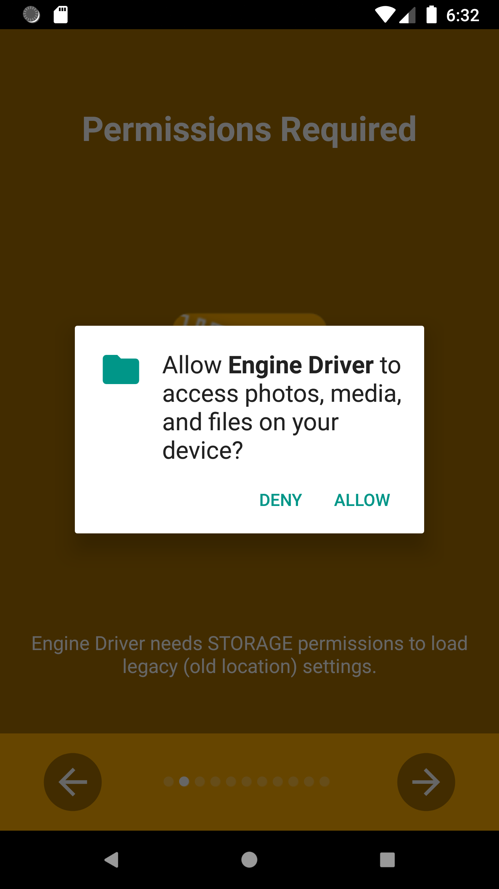
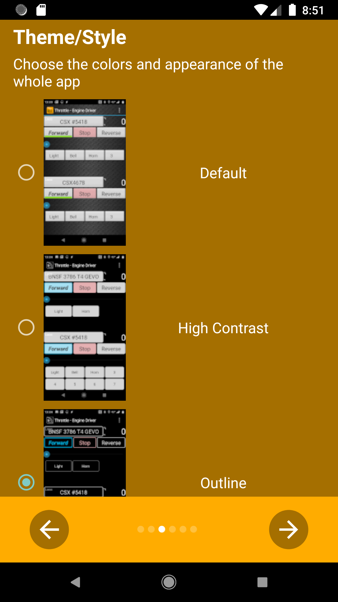

*******************************************
Setup Wizard
*******************************************

.. meta::
   :keywords: setup wizard

.. include:: ../include.rst

.. sidebar::

  .. contents:: On This Page
     :local:
     :depth: 3

----

The *Setup Wizard* will start automatically the first time you run |ed| after you install it.  It sets some basic preferences and asks for the necessary permissions.  These preferences can be subsequently be changed use the : :menuselection:`Menu --> Preferences`, or by re-running the wizard, which can only be done from the menu on the |C-S|.

Initial Screen
--------------

.. image:: ../_static/images/setup_wizard/setup1.png
   :scale: 12 %

Permissions
-----------

.. image:: ../_static/images/setup_wizard/setup1b.png
   :scale: 12 %

.. image:: ../_static/images/setup_wizard/setup1c.png
   :scale: 12 %

.. image:: ../_static/images/setup_wizard/setup1d.png
   :scale: 12 %

.. image:: ../_static/images/setup_wizard/setup1e.png
   :scale: 12 %

Android 11 Changes
------------------

.. image:: ../_static/images/setup_wizard/setup1f.png
   :scale: 12 %

Throttle Name
-------------

.. image:: ../_static/images/setup_wizard/setup2.png
   :scale: 12 %

Theme / Style
-------------

Throttle Screen Layout
----------------------

.. image:: ../_static/images/setup_wizard/setup4.png
   :scale: 12 %

Speed Sliders and Buttons
-------------------------

.. image:: ../_static/images/setup_wizard/setup5.png
   :scale: 12 %

Ready
-----

.. image:: ../_static/images/setup_wizard/setup6.png
   :scale: 12 %
