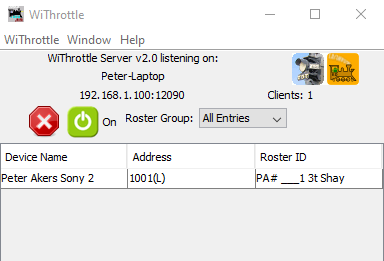

*******************************************
Prerequisites for Using Engine Driver
*******************************************

.. meta::
   :keywords: prerequisites

.. include:: ../include.rst

.. sidebar::

  .. contents:: On This Page
    :local:

To Use Engine Driver You must...
--------------------------------

1. Have a Android device/phone. |br| |ed| can only be installed on an Android device/phone.

*ALSO*

1. A |WTS| must be available on a device connected to your model train layout for |ed| to connect to.

Android Device/Phone
--------------------

|ed| will work on most Android devices made in the last 8-9 years. Currently it has a minSDKVersion 16, which equates to minimum Android OS version of 4.1 (JELLYBEAN). Info on minSDKVersion available in the `Engine Driver manifest <https://developer.android.com/guide/topics/manifest/uses-sdk-element#ApiLevels>`_.

.. image:: ../_static/images/gamepads/esu_mcii.png
   :scale: 15 %
   :align: right

ESU MobileControl II
""""""""""""""""""""

|ed| also fully supports the `ESU MobileControl II (MC2) <http://www.esu.eu/en/products/digital-control/mobile-control-ii/>`_ Android throttle.

.. note:: 
  :class: note-ed-hidden-title
  
  See the `ESU MobileControl II <../operation/esu_mcii.html>`_ page for more information.

WiThrottle Servers
------------------

For JMRI
""""""""

Verify your Android device can connect to your network via WiFi and obtain an IP address.
Make sure you are running one of the latest versions of `JMRI <https://jmri.org/>`_ (3.8 works, 4.20+ works much better) on your PC, connected to your layout. 
Start up JMRI and verify you can use JMRI's included 'Throttle' window to control a loco on your layout.

Start the `WiThrottle <https://www.jmri.org/help/en/package/jmri/jmrit/withrottle/Protocol.shtml>`_ function of JMRI, located in DecoderPro under Tools, Throttles.  

It is also highly recommended that you start the `JMRI Web Server function <https://www.jmri.org/help/en/html/web/index.shtml>`_ (Tools, Start JMRI Web Server). 
Both of these should be added to Preferences, Start Up as well.

For DCC++EX WiFi
""""""""""""""""

`DCC++EX <https://dcc-ex.com/index.html>`_ includes a built-in `WiThrottle Server <https://dcc-ex.com/throttles/protocols.html#the-withrottle-server>`_. Build your `DCC++EX Command Station <https://dcc-ex.com/get-started/index.html>`_, add `WiFi <https://dcc-ex.com/get-started/wifi-setup.html>`_, then connect EngineDriver following `these steps <https://dcc-ex.com/throttles/protocols.html#the-withrottle-server>`_.

For MRC WiFi
""""""""""""

Connect the `MRC WiFi module <https://www.modelrectifier.com/category-s/332.htm>`_, and verify your device can connect to its network and obtain an IP address.
Note for MRC users: David Fuller has provided some `additional setup information [here] <https://enginedriver.mstevetodd.com/sites/enginedriver.mstevetodd.com/files/EngineDriver_App-MRC_Wi-Fi_Module_Settings.pdf>`_.

For Digitrax LnWi
"""""""""""""""""

Connect the `Digitrax LnWi <https://www.digitrax.com/products/wireless/lnwi/>`_, and verify your device can connect to its network and obtain an IP address.
